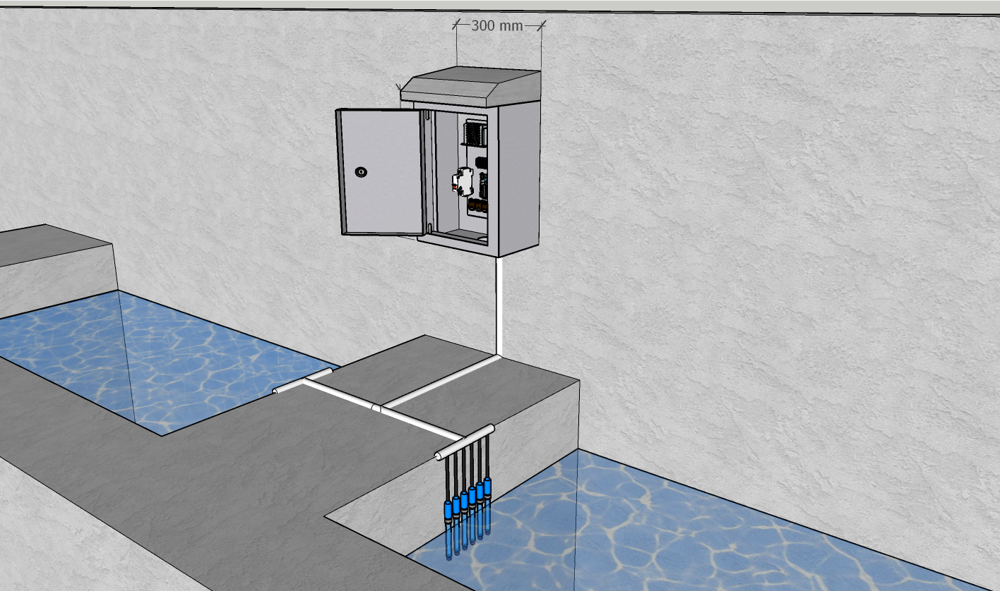
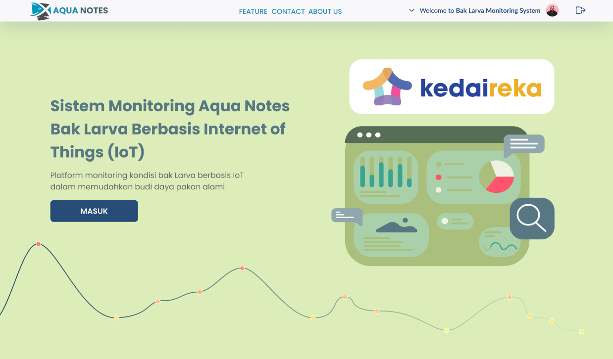
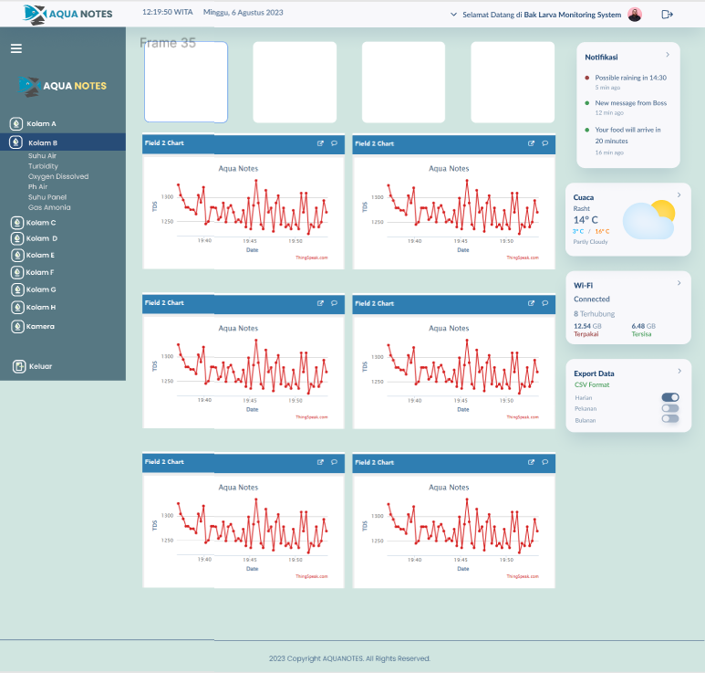
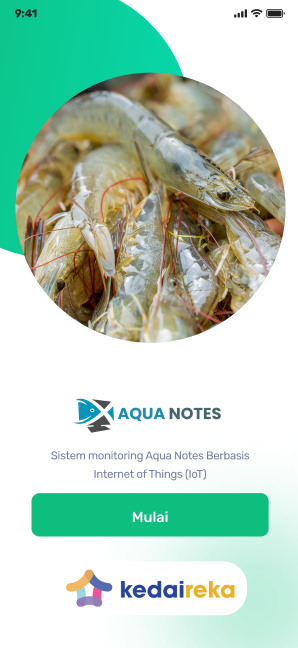
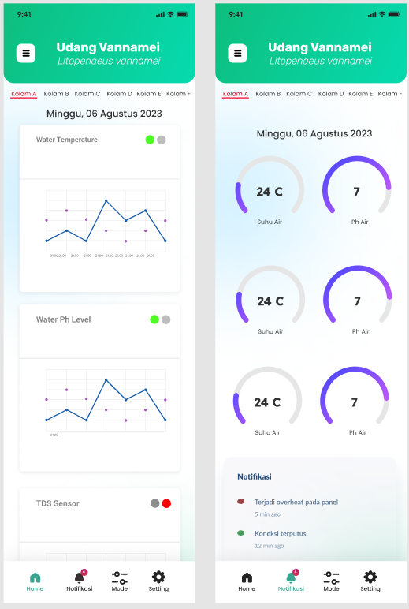

# IoT Shrimp Farm Monitoring Project

## Project Overview

The IoT Shrimp Farm Monitoring Project is aimed at developing a comprehensive system for monitoring and managing crucial parameters in a Vannamei shrimp cultivation pond. This project employs various sensors to collect real-time data on six essential parameters: water temperature, Total Dissolved Solids (TDS), dissolved oxygen levels, air temperature, pH levels, and ammonia concentration. The collected data is processed using an Arduino Uno, transmitted to a Raspberry Pi for further processing and storage, and then visualized through a web application and a mobile app.

## Table of Contents

- [Introduction](#introduction)
- [Components](#components)
- [System Architecture](#system-architecture)
- [Data Flow](#data-flow)
- [Installation](#installation)
- [Usage](#usage)
- [Web Application](#web-application)
- [Mobile App](#mobile-app)
- [Future Enhancements](#future-enhancements)
- [Contributing](#contributing)
- [License](#license)

## Introduction

The cultivation of Vannamei shrimp requires meticulous monitoring of environmental parameters to ensure optimal growth and health. This IoT project integrates sensors, microcontrollers, and software to provide a comprehensive solution for data collection, processing, storage, and visualization.

## Components

- Arduino Uno: Collects data from the six sensors.
- Raspberry Pi: Manages data processing, storage, and communication.
- Sensors: Measures water temperature, TDS, dissolved oxygen, air temperature, pH, and ammonia levels.
- Web Server: Hosts the web application and database.
- Mobile App: Provides real-time access to data and alerts.

## System Architecture

The project architecture involves three main stages: data collection, data processing, and data visualization.

## Data Flow

1. Sensors collect parameter data in the shrimp pond.
2. Arduino Uno processes the sensor data and sends it to the Raspberry Pi.
3. Raspberry Pi receives, stores, and processes the data.
4. Processed data is stored in the hosted database.
5. Web application and mobile app retrieve and display the data.

## Installation

1. Clone the repository.
2. Set up the Arduino Uno with the sensors.
3. Configure the Raspberry Pi with required libraries.
4. Set up the web server and database.
5. Install the mobile app on your device.

## Usage

1. Power on the Arduino Uno and Raspberry Pi.
2. Data will be automatically collected and transmitted.
3. Access the web application or mobile app to view real-time data.

## Web Application

The web application provides an intuitive interface to monitor the shrimp pond parameters. Users can visualize current and historical data, set alerts, and analyze trends.

## Mobile App

The mobile app offers on-the-go access to vital data. Users receive push notifications for critical parameter breaches and can view data anytime.

## Future Enhancements

1. Implement machine learning for predictive analysis.
2. Enhance the mobile app with more features.
3. Integrate automated actuators for parameter control.
4. Develop multi-lingual support for wider usability.

## Contributing

Contributions are welcome! Fork the repository, create a branch, and submit a pull request explaining your changes.

## License

This project is licensed under the [MIT License](LICENSE).

---
